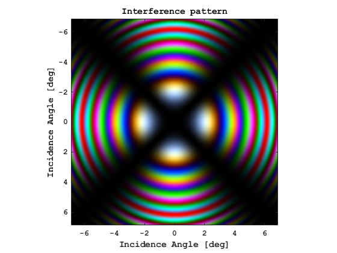
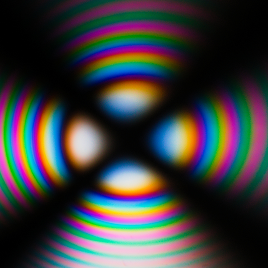

This repository provides a collection of scripts and examples to simulate real-life optical effects caused by birefringence, a phenomenon where light experiences different refractive indices depending on its polarization and propagation direction.

The goal is to help students, researchers, and optics enthusiasts visualize and understand birefringent phenomena, and to model devices that rely on birefringence.

The project aims to:

- Offer easy-to-use simulation tools for birefringence-based effects.

- Provide didactic examples for teaching and learning polarization optics.

  
Here is the first simulation result: 

here is the real life photography of the effect, who was nominated  𝐈𝐦𝐚𝐠𝐞 𝐨𝐟 𝐭𝐡𝐞 𝐖𝐞𝐞𝐤 
by Optica’s Optics & Photonics News:

To reproduce or modify the simulation, just download the repository and run the 'SimulationBirefringenceIntensityPattern_iso.m' MATLAB file, change the parameters as desired, change the material by changing the refractive index table contained in the 'birefringence.mat' file.  I might convert the script to python in future, feel free to do it before me and then adding it to the repository.
